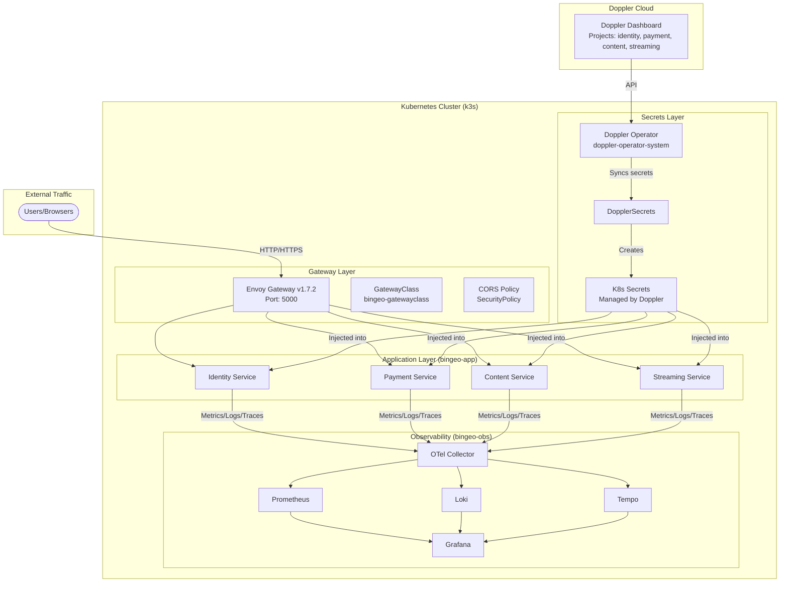
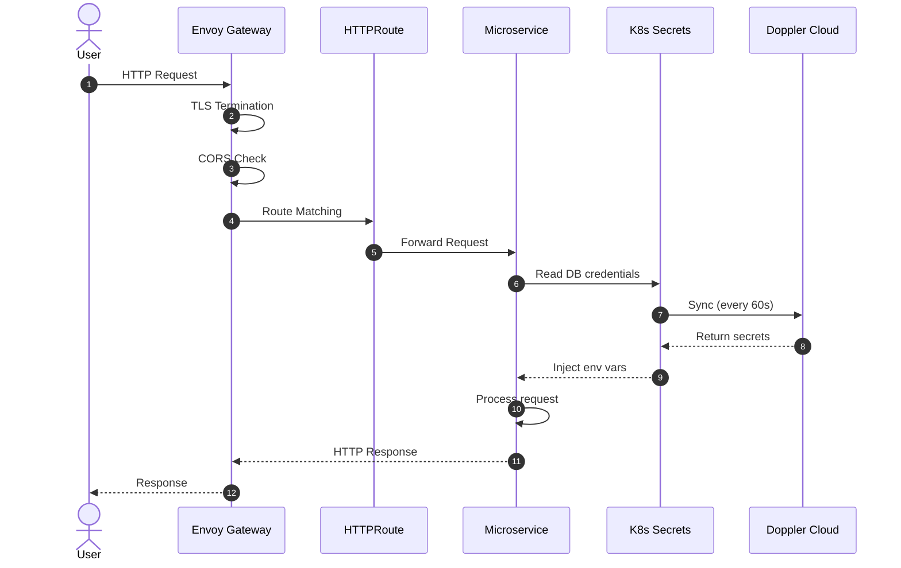
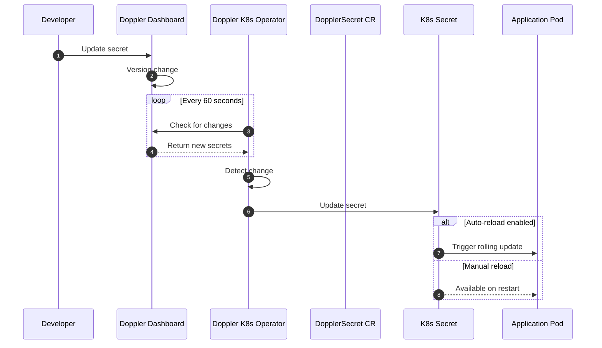
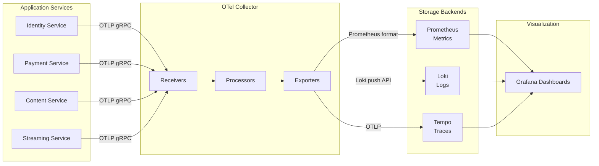
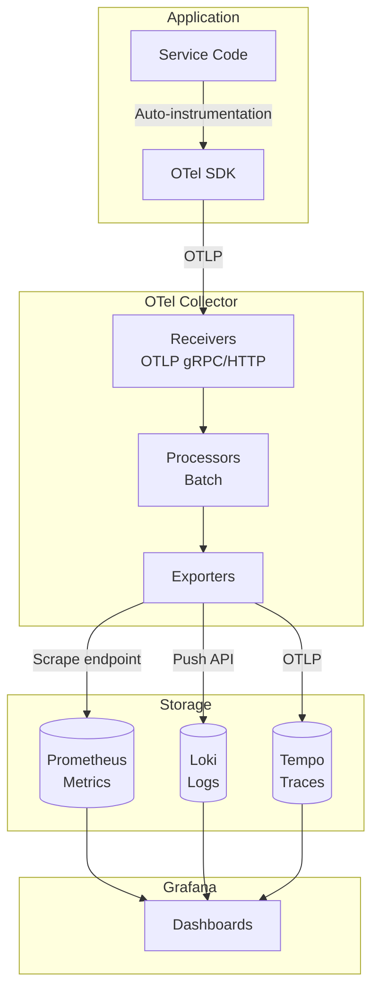

# Bingeo Infrastructure

Cloud-native infrastructure for the Bingeo OTT Platform. Built on Kubernetes with Envoy Gateway, Doppler secrets management, and comprehensive observability.

## Table of Contents

- [Architecture Overview](#architecture-overview)
- [System Flow Diagrams](#system-flow-diagrams)
- [Quick Start](#quick-start)
- [Detailed Setup](#detailed-setup)
- [Doppler Secrets Management](#doppler-secrets-management)
- [Service Management](#service-management)
- [Observability](#observability)
- [Troubleshooting](#troubleshooting)
- [Reference](#reference)

---

## Architecture Overview

### Technology Stack

| Component | Technology | Version |
|-----------|------------|---------|
| **Container Orchestration** | Kubernetes (k3s) | Latest |
| **Gateway** | Envoy Gateway | v1.7.2 |
| **Gateway API** | Kubernetes Gateway API | v1.2.1 |
| **Secrets Management** | Doppler + K8s Operator | Latest |
| **Observability** | Prometheus, Grafana, Loki, Tempo, OTel | Latest |
| **Dev Workflow** | Skaffold | v4beta13 |

### Infrastructure Architecture



---

## System Flow Diagrams

### 1. Request Flow



### 2. Secrets Sync Flow



### 3. Observability Data Flow



---

## Quick Start

### Prerequisites

- [Docker](https://docs.docker.com/get-docker/)
- [kubectl](https://kubernetes.io/docs/tasks/tools/)
- [Helm](https://helm.sh/docs/intro/install/)
- [Skaffold](https://skaffold.dev/docs/install/)
- [k3s](https://docs.k3s.io/quick-start) or any Kubernetes cluster
- [Doppler CLI](https://docs.doppler.com/docs/cli) (optional, for testing)

### 1. First Time Setup

```bash
# Clone the infrastructure repo
git clone https://github.com/your-org/bingeo-infra.git
cd bingeo-infra

# Initialize service submodules (if using)
make submodules-init

# Install infrastructure (Envoy Gateway + Doppler Operator)
make setup
```

### 2. Configure Doppler Secrets

```bash
# Interactive Doppler setup
make doppler-setup
# Select option 1) Setup Doppler Service Token
# Enter your Doppler service token

# Create DopplerSecrets for services
make doppler-identity
make doppler-payment
# Or create all at once:
make doppler-all
```

### 3. Run Services

```bash
# Run single service
make identity

# Run full stack
make full

# Run with observability
make full-obs

# Port-forward gateway and dashboards
make ports
```

---

## Detailed Setup

### Infrastructure Components Setup

#### 1. Envoy Gateway v1.7.2

Envoy Gateway is installed automatically by `make setup`. Manual installation:

```bash
# Install Gateway API CRDs (v1.2.1)
kubectl apply --server-side \
  -f https://github.com/kubernetes-sigs/gateway-api/releases/download/v1.2.1/standard-install.yaml

# Install Envoy Gateway via Helm
helm upgrade --install bingeo-eg oci://docker.io/envoyproxy/gateway-helm \
  --version v1.7.2 \
  -n bingeo-envoy-gateway \
  --create-namespace \
  --wait --timeout 5m

# Create Gateway resources
kubectl apply -f k8s/manual/envoy-gateway/
```

#### 2. Doppler Secrets Operator

The Doppler operator syncs secrets from Doppler to Kubernetes automatically.

**How it works:**
- You create secrets in [Doppler Dashboard](https://dashboard.doppler.com)
- The operator polls Doppler API every 60 seconds
- When secrets change, the operator updates Kubernetes secrets
- Apps can auto-reload when secrets change (with annotation)

**Installation (automatic with make setup):**

```bash
helm repo add doppler https://helm.doppler.com
helm upgrade --install doppler-operator doppler/doppler-kubernetes-operator \
  -n doppler-operator-system \
  --create-namespace
```

**Configuration steps:**

1. **Get Doppler Service Token:**
   - Go to [Doppler Dashboard](https://dashboard.doppler.com/workplace/{workplace}/service_tokens)
   - Create a Service Token with access to your projects
   - Token format: `dp.st.dev.xxxx` or `dp.st.prd.xxxx`

2. **Store token in Kubernetes:**
   ```bash
   kubectl create secret generic doppler-token-secret \
     -n doppler-operator-system \
     --from-literal=serviceToken=dp.st.dev.xxxx
   ```

3. **Create DopplerSecret for each service:**
   ```yaml
   apiVersion: secrets.doppler.com/v1alpha1
   kind: DopplerSecret
   metadata:
     name: identity-service-doppler-secret
     namespace: doppler-operator-system
   spec:
     tokenSecret:
       name: doppler-token-secret
     project: bingeo-identity    # Your Doppler project name
     config: dev                 # Doppler config (dev/stg/prd)
     managedSecret:
       name: identity-service-secrets
       namespace: bingeo-app
   ```

4. **Use in deployments:**
   ```yaml
   spec:
     template:
       spec:
         containers:
           - name: identity-service
             envFrom:
               - secretRef:
                   name: identity-service-secrets
```

---

## Doppler Secrets Management

### Project Structure in Doppler

Recommended structure for Bingeo:

```
Doppler Workplace
├── bingeo-identity (Project)
│   ├── dev (Config)
│   │   ├── DATABASE_URL
│   │   ├── REDIS_URL
│   │   ├── JWT_SECRET
│   │   └── RESEND_API_KEY
│   ├── stg (Config)
│   └── prd (Config)
│
├── bingeo-payment (Project)
│   ├── dev
│   ├── stg
│   └── prd
│
├── bingeo-content (Project)
│   └── ...
│
└── bingeo-streaming (Project)
    └── ...
```

### Available Commands

| Command | Description |
|---------|-------------|
| `make doppler-setup` | Interactive Doppler configuration wizard |
| `make doppler-status` | Check Doppler sync status |
| `make doppler-identity` | Create DopplerSecret for identity service |
| `make doppler-payment` | Create DopplerSecret for payment service |
| `make doppler-content` | Create DopplerSecret for content service |
| `make doppler-streaming` | Create DopplerSecret for streaming service |

### Auto-reload on Secret Change

Add this annotation to deployments for automatic pod restart when secrets change:

```yaml
apiVersion: apps/v1
kind: Deployment
metadata:
  name: identity-service
  annotations:
    secrets.doppler.com/reload: 'true'
spec:
  template:
    spec:
      containers:
        - name: identity-service
          envFrom:
            - secretRef:
                name: identity-service-secrets
```

---

## Service Management

### Running Individual Services

```bash
# Identity service only
make identity

# Payment service only
make payment

# Content service (includes identity for auth)
make content

# Streaming service
make streaming
```

### Running Combinations

```bash
# Auth + Payment
make auth-payment

# Full playback flow (Identity + Content + Streaming)
make playback
```

### Running Full Stack

```bash
# All services without observability
make full

# All services with Prometheus/Grafana/Loki/Tempo
make full-obs
```

---

## Observability

### Accessing Dashboards

After running `make ports`:

| Service | URL | Description |
|---------|-----|-------------|
| **Gateway** | http://localhost:5000 | API Entry point |
| **Grafana** | http://localhost:3000 | Unified dashboards (admin/admin) |
| **Prometheus** | http://localhost:9090 | Metrics querying |

### Pre-configured Grafana Datasources

- **Prometheus** (default) - Metrics
- **Loki** - Log aggregation
- **Tempo** - Distributed tracing

### Architecture



---

## Troubleshooting

### Common Issues

#### 1. Gateway API CRDs not found

**Error:** `error: resource mapping not found for name: "bingeo-gatewayclass"`

**Fix:**
```bash
kubectl apply --server-side \
  -f https://github.com/kubernetes-sigs/gateway-api/releases/download/v1.2.1/standard-install.yaml
```

#### 2. Envoy Gateway pods not starting

**Diagnose:**
```bash
kubectl get pods -n bingeo-envoy-gateway
kubectl logs -n bingeo-envoy-gateway deployment/envoy-gateway
kubectl describe pod -n bingeo-envoy-gateway -l app.kubernetes.io/name=envoy-gateway
```

**Common causes:**
- Insufficient cluster resources
- Gateway API CRDs not installed
- Network policies blocking traffic

#### 3. Doppler secrets not syncing

**Diagnose:**
```bash
make doppler-status
kubectl logs -n doppler-operator-system deployment/doppler-operator-controller-manager
kubectl get dopplersecrets -n doppler-operator-system -o yaml
```

**Fix:**
1. Check Doppler token is valid
2. Verify token secret exists: `kubectl get secret doppler-token-secret -n doppler-operator-system`
3. Check Doppler project name matches exactly
4. Verify network connectivity to Doppler API

#### 4. Services can't reach each other

**Diagnose:**
```bash
kubectl get svc -n bingeo-app
kubectl get httproute -A
kubectl describe gateway bingeo-gateway -n bingeo-envoy-gateway
```

**Fix:**
- Ensure services are in `bingeo-app` namespace
- Check HTTPRoutes are properly configured in service repos
- Verify Gateway allows routes from all namespaces

#### 5. Skaffold build failures

**Fix:**
```bash
# Clean and rebuild
make clean
skaffold delete
make setup

# Check Docker daemon
docker ps

# Verify submodules exist
ls -la services/
```

#### 6. Port-forwarding issues

**Error:** `Unable to listen on port 5000`

**Fix:**
```bash
# Kill existing port-forwards
pkill -f "kubectl port-forward"

# Use different ports
kubectl port-forward -n bingeo-envoy-gateway svc/envoy-bingeo-gateway-xxx 8080:5000
```

### Debugging Commands

```bash
# Full cluster status
make status

# Service logs
make logs SVC=identity-service

# Shell into pod
kubectl exec -it -n bingeo-app deployment/identity-service -- /bin/sh

# Check secret values (base64 decoded)
kubectl get secret identity-service-secrets -n bingeo-app -o jsonpath='{.data}' | jq -r 'to_entries[] | "\(.key): \(.value | @base64d)"'

# Test gateway connectivity
curl -v http://localhost:5000/health

# Check Envoy configuration
kubectl port-forward -n bingeo-envoy-gateway svc/envoy-bingeo-gateway-xxx 9901:9901
curl http://localhost:9901/config_dump
```

### Getting Help

1. Check service logs: `make logs SVC=<service-name>`
2. Verify Doppler status: `make doppler-status`
3. Review operator logs: `kubectl logs -n doppler-operator-system deployment/doppler-operator-controller-manager`
4. Check [Envoy Gateway docs](https://gateway.envoyproxy.io/)
5. Check [Doppler K8s docs](https://docs.doppler.com/docs/kubernetes-operator)

---

## Reference

### Directory Structure

```
bingeo-infra/
├── k8s/
│   ├── base/                    # Base infrastructure
│   │   └── keep-alive.yaml      # Skaffold module placeholder
│   ├── doppler/                 # Doppler integration
│   │   ├── README.md            # Doppler setup guide
│   │   └── templates/           # DopplerSecret CRs
│   │       ├── dopplersecret-identity.yaml
│   │       ├── dopplersecret-payment.yaml
│   │       ├── dopplersecret-content.yaml
│   │       └── dopplersecret-streaming.yaml
│   ├── manual/
│   │   └── envoy-gateway/       # Manual Envoy Gateway config
│   │       ├── gateway-class.yaml
│   │       ├── gateway.yaml
│   │       ├── envoy-proxy-config.yaml
│   │       └── cors-policy.yaml
│   └── networking/              # Network policies
├── observability/               # Observability stack
│   ├── grafana/
│   ├── prometheus/
│   ├── loki/
│   ├── tempo/
│   └── otel-collector/
├── scripts/
│   ├── setup.sh                 # Main setup script
│   ├── clean.sh                 # Cleanup script
│   └── doppler-setup.sh         # Doppler interactive setup
├── services/                    # Git submodules (service repos)
├── client/                      # Git submodule (frontend)
├── terraform/                   # AWS infrastructure (future)
├── skaffold.yaml               # Skaffold configuration
├── Makefile                    # CLI commands
└── README.md                   # This file
```

### Makefile Reference

See `make help` for all available commands.

### Version History

| Date | Change |
|------|--------|
| 2025-01 | Updated to Envoy Gateway v1.7.2 |
| 2025-01 | Migrated from env files to Doppler secrets |
| 2025-01 | Updated Gateway API to v1.2.1 |
| 2024-12 | Initial infrastructure setup |

---

## Contributing

1. Update version variables in `scripts/setup.sh` for new releases
2. Test changes with `make clean-all && make setup`
3. Update this README with any new patterns
4. Follow existing naming conventions for resources
